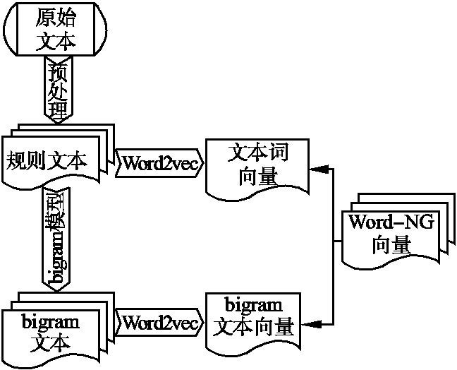
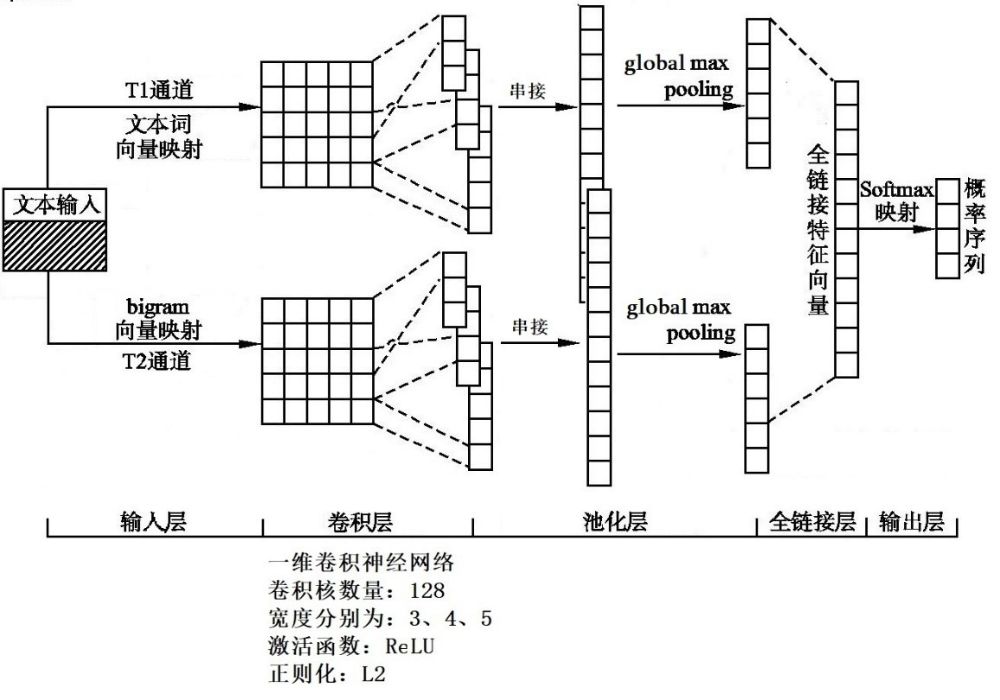
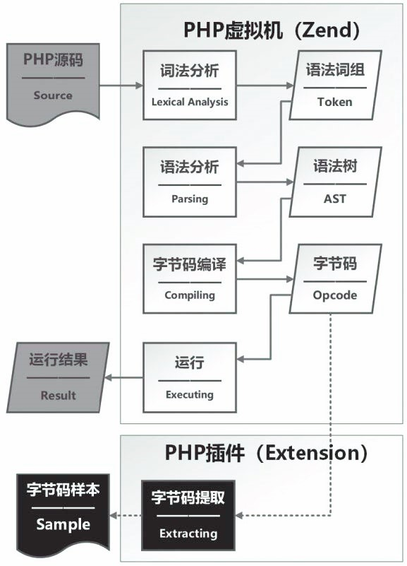

# Use Word-NG vec to detect WebShell 
## Background

Inspried by  [WordNG-Vec:一种应用于CNN文本分类的词向量模型](http://www.cnki.net/kcms/detail/detail.aspx?filename=XXWX201903007&dbname=cjfdtotal&dbcode=cjfd&v=MjAyNTNBdnIzV0EyRnJDVVJMT2ZZdVpuRkN2a1ZMdktQVFhjZHJHNEg5ak1ySTlGWTRRT0NYOUt2QlJsNzBrT1E=)，a text classfication method that combains word2vec and Bi-Gram, which not only considered the semantic features but also the word order features, has a better classfication result than using two features alone.

In order to cope with the current complex and flexible WebShell attack environment and better detect various types of webshells, an improved WebShell detection method based on CNN was proposed by improving text feature extraction and convolutional neural network structure. First, precompile the PHP data set to get the opcode instruction sequence. Secondly, Word2vec is used to extract the word vectors of the original text and the phrase segmented by bi-gram respectively, and it serves as the two inputs of the convolutional neural network. Finally, the detection is carried out through the designed convolutional neural network. Through experiments, this method effectively improves the accuracy, recall rate and other performance parameters while compared with other methods.

## Introduction

### Word-NG vec

In fact, the word embedding learned in Word2vec are more reflect in semantic similarity features , such as "extract" and "take", "compression" and "reduction", but without taking the word order features into account. Sometimes there are some differences with the actual semantics, for example:

> The USA started a trade war on China

The main predicates of two sentences are interchanged to express different meanings, but there is no difference in Word2Vec.  However, if N-Gram is used to divide the text into word groups ,  we can obtain the word order feature of the text，such as:

| Orignal  | The USA started  a trade war on China                        |
| -------- | ------------------------------------------------------------ |
| Word2vec | “The USA”，“started”，"a"，“trade war”，“on”，“China”   (vector) |
| 2-gram   | “The USA/The USA” ，“The USA/started”，"stared"/a”，“a/trade war”，"trade war/on"，“on China” |




Combining N-Gram with Word2vec, the word vectors of the original text and 2-gram pharse are both trained by Word2vec as the general features of the text, taking into account not only the semantic features, but also the word order features. In this way, two similar sentences can be correctly classifcated.

### Convolutional Neural Network

Based on the Kim Y's [TextCNN](https://arxiv.org/abs/1408.5882), combined with the two-channel convolutional neural network, a text classification model DCTF-CNN(Double-Channels and Trible-Filters Convolutional Neural Network)  was constructed.

The structure of the neural network is shown below:



The model includes five layers: input layer, convolution layer, pooling layer, full-link layer and output layer.In the input layer, T1 channel and T2 channel respectively input the word vector of the original text and the word vector of the 2-gram pharse. The convolution layer is composed of three convolution kernels of different widths, each of which covers the local characteristics of different granularity.In the pooling layer, the global maximum value is pooled, and the maximum value is reserved for each convolution kernel, which can effectively extract the most representative features.Two feature vectors were spliced in the full link layer, and finally two types of distributions, namely the probability distribution of WebShell and normal files, were output through Softmax in the output layer.

### PHP opcode

PHP is an interpreted language, and its code execution process can be divided into Lexical Analysis stage, Syntax Analysis stage, byte code compilation stage and code execution stage.The execution flow diagram is shown in the solid line section in the below:



In the lexical analysis phase, the Lexer reads the source code sequence of characters in sequence and shred them into Token sequences according to PHP syntax rules.In the Syntax analysis stage, the Token sequence is read in by the Parser to be syntactically checked, and then the Abstract Syntax Tree (AST) is generated.In the bytecode compilation phase, the PHP virtual machine Zend reads in the abstract syntax tree and translates the action nodes in the syntax tree into the corresponding bytecode.In the code execution stage, the PHP virtual machine Zend loads the corresponding module according to the code call, initializes the running environment, and finally executes the bytecode instruction and outputs the result.

For example, the following code:

```php
<?php
echo’Hello World’;
$a=1+1;
echo $a;
?>
```

After PHP code compilation by VLD extension, the code can be compiled into following opcode:

```
ZEND_ECHO ’Hello World’
ZEND_ADD ~ 0 1 1
ZEND_ASSIGN!0 ~ 0
ZEND_ECHI ~ 0
```

In this paper, the collected PHP datasets is compiled into opcode to word embedding, so as to avoid the interference of useless annotations added in the WebShell which might bypass static detection. In this way the generalization of the model could be imporved

## Assessment

Experimental data sets were obtained from the following sources:

|    Type     | sources                                                      |
| :---------: | :----------------------------------------------------------- |
|  WebShell   | https://github.com/tennc/webshell<br/>    https://github.com/JohnTroony/php-webshells<br/>    https://github.com/ysrc/webshell-sample<br/>    https://github.com/tanjiti/webshellSample<br/>    https://github.com/xl7dev/WebShell |
| Normal Page | https://github.com/WordPress/WordPress<br/>    https://github.com/phpmyadmin/phpmyadmin<br/>    https://github.com/typecho/typecho<br/>    https://github.com/bcit-ci/CodeIgniter<br/>    https://github.com/laravel/laravel |

Remove duplicate files by md5 comparsion, a total of 2387 WebShell samples and 2316 Normal Page samples were obtained.

The WebShell samples covers One-word Trojan, small Trojan and giant Trojan all types of WebShell.

The Normal Page covers blog cms，php development framework and database management system, and the similar page was remove to optimize data sets.

## Usage

Download code and data sets

```
git clone https://github.com/liyuanzi/WordNG-vec_WebShell_detect
```

This code requires Python2.7

```
conda create --name py27 python=2.7
```

Initialization environment

```
pip install -r requerments.txt
```

start trainning

```
$ nohup python -u webshell.py >dctf.txt 2>&1 & tail -f dctf.txt
```

The word embedding process takes a very long time，use `nohup` to avoid the word embedding process fail because the terminal closed unexpectly. The result is loaded  into `dctf.txt`

## Example

A Comparsion examination on a small  size data sets .

| features         | Accuracy | Precision | Recall | F1-score |
| ---------------- | -------- | --------- | ------ | -------- |
| 2-gram           | 0.798    | 0.714     | 0.196  | 0.308    |
| opcode sequences | 0.969    | 0.998     | 0.823  | 0.902    |
| Word2vec        | 0.958 | 0.994 | 0.918 | 0.954 |
| bigram-word2vec | 0.960 | 0.978 | 0.937 | 0.958 |
| Word-NG vec     | 0.984 | 0.995 | 0.971 | 0.982 |
